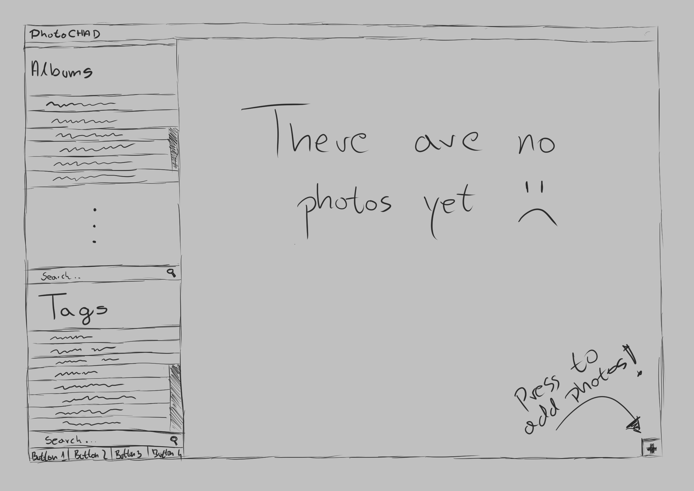
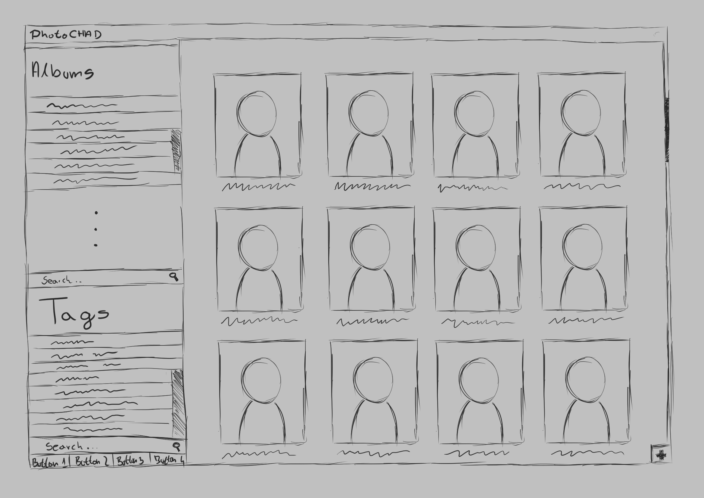
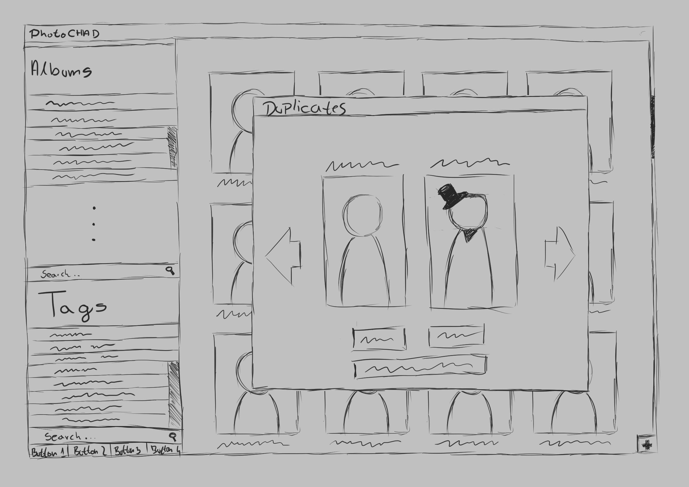
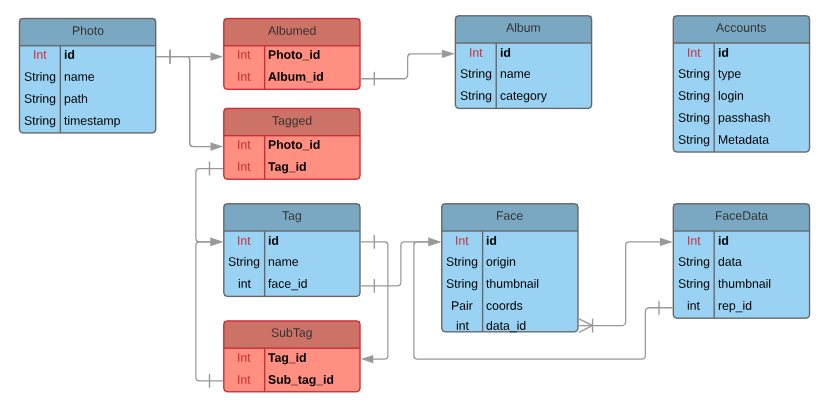

\maketitle

# 1. Scenariusze dialogu człowieka z komputerem

## Scenariusz 1.

Dodawanie nowych zdjęć do galerii

`Funkcjonalność`: Galeria zdjęć

Dane jest okno główne aplikacji.
Kiedy użytkownik naciśnie przycisk plusa w prawym dolnym rogu, zostanie wyświetlone okno menadżera plików, gdzie wybiera pliki.

## Scenariusz 2.

Przeglądanie posiadanych katalogów posiadających zdjęcia poprzedzielane do poszczególnych kategorii.

`Funkcjonalność`: Katalogi zdjęć

Dane jest okno główne aplikacji.
Po prawej stronie znajduje się pasek wyboru albumów.
Użytkownik wybiera, bądź wpisuję nazwę interesującego go albumu, po czym na stronie głównej zostaną wyświetlone zdjęcia, które do niego należą.

## Scenariusz 3.

Wykrycie oraz weryfikacja duplikatów przez użytkownika

`Funkcjonalność`: Wykrywanie duplikatów

Dane jest okno główne aplikacji.
Podczas dodawania nowych zdjęć użytkownik zostaje poinformowany przez wyskakujące okno o możliwym duplikacie. Użytkownik stwierdza, że rzeczywiście zdjęcia sa takie same, dlatego wybiera to o lepszej rozdzielczości (prawe), poprzez kliknięcie w nie. Drugie zdjęcie zostaje usunięte(bądź nie zostanie dodane).

# 2. Projekt ekranów scenariuszy

\newpage

## Ekran aplikacji bez zdjęć

## Ekran przeglądania katalogów

## Ekran wykrycia duplikatu

# 3a. Model konceptualny rzeczywistości

* Photo
    - przechowuje podstawowe informacje o pojedynczym zdjęciu
    - przechowuje jeden lub więcej 'wskaźników' na albumy w których może się znajdować (many-to-many)
    - przechowuje jeden lub więcej 'wskaźników' na tagi którymi są opisane (many-to-many)

* Album
    - przechowuje informacje o kategorii (ale nie o zdjęciach się w nim znajdujących)

* Tag
    - przechowuje informacje o tagu (ale nie zdjęciach nim opisanych)
    - może, ale nie musi przechowywać dokładnie jeden wskaźnik na dane twarzy (one-to-one)
    - może, ale nie musi przechowywać jeden lub więcej wskaźników na tagi (metatag; many-to-many)

* Face
    - przechowuje informacje o twarzy (thumbnail, oryginalne zdjęcie, koordynaty twarzy)
    - przechowuje dokładnie jeden wskaźnik do danych twarzy (many-to-one)

* FaceData
    - przechowuje informacje o twarzy (generalne informacje o twarzy dla algorytmu wykrywającego)
    - przechowuje dokładnie jeden wskaźnik na Face (one-to-one; reprezentant - służy do wyświetlania thumbnalia)

* Accounts
    - przechowuje dane logowania do kont w usługach firm trzecich (Facebook, Flicrk, etc.)

# 3b. Wymienienie oraz przedstawienie graficzne elementów aplikacji oraz powiązań:

## Sprzęt

Systemami którymi chcemy się zajmować to:

- w przypadku komputerów stacjonarnych i laptopów, chcemy skupić się na wsparciu dla Windowsa 7 i wyżej, OS X oraz GNU+Linux,

- jeżeli chodzi o smartphone'y to celujemy w API wersji 22 czyli Android Lollipop (5.1) i wyżej oraz IOS. 

W przypadku testowania mamy zamiar sprawdzić większe spektrum urządzeń (oraz wersji systemów), aczkolwiek nie mamy zamiaru
przykładać większej uwagi do przestarzałych kompilacji systemów.

## Oprogramowanie systemowe, bazy danych, narzędzia programistyczne, oprogramowanie do testowania

Do tworzenia samego oprogramowania będziemy mieli dostępny pakiet IDE od JetBrains, aczkolwiek każdy z developerów
będzie mógł używać takiego edytora, w jakim pracuje mu się najlepiej. Przed każdym commitem do repozytorium
będzie uruchamiany specjalny hook git'a, który to odpowiednio przeformatuje kod aby był zgodny z Code Stylem.

Do obsługi baz danych wykorzystamy bibliotekę SQLite, a wszystko będzie zapisane w jednym pliku, który jest na tyle mały,
że bez większych problemów będzie go wczytać w całości do pamięci RAM.

Poza tym będziemy oczywiście używać wszystkich narzędzi dostarczonych z rustup, w szczególności `cargo`, który jest
podstawowym managerem projektów dla języka Rust. Jako, że obsługa unit-testów jest wbudowana bezpośrednio w `cargo`,
a także w pewien sposób wspierana przez sam język, testowanie jest proste niczym wpisanie odpowiedniej komendy, co
też pozwala na łatwe wydelegowanie testowania do usługi CI (continuous integration, np. Travis albo Jenkins).

## Struktury podziału obiektowego kodu

Jeżeli chodzi o podział kodu, będziemy chcieli mocno korzystać z systemu modułów zapewnianego przez język.
Główny podział to oczywiście kompletne rozdzielenie backendu i frontendu, a więc najpierw zbudowanie części logicznej odpowiedzialnej
za interakcje na zdjęciach i albumach. Ta część byłaby też zbudowana z innych modułów, aczkolwiek udostępniające już bardziej abstrakcyjne
API, mianowicie:
    
- moduł odpowiedzialny za operacje graficzne na plikach, tj. wczytywanie plików, zapisywanie, najprostsza edycja rastorowa,
      oraz dostęp do metadanych pliku, a to wszystko abstrahując od faktycznego formatu pliku
    
- (później) moduł odpowiedzialny za bardziej zaawansowane operacje na plikach graficznych będący swoistym rozszerzeniem
      wcześniej wymienionego modułu, udostępniający rozszerzenia do API poprzedniego modułu
    
- moduł odpowiedzialny za detekcje twarzy
    
- moduł odpowiedzialny za detekcje obiektów
    
- moduł odpowiedzialny za zarządzanie samą galerią, w myśli generyczny co do bazy danych aczkolwiek zoptymalizowany pod SQLite.
      Jego zadaniem będzie udostępnianie ładnego interfejsu, pozwalającego na modyfikacje ale także pobieranie wszelkich informacji o galerii
      takich jak informacje o zdjęciach, albumach czy w końcu informacji dla innych modułów.

Na tak zbudowany backend udostępniałby kolejno zewnętrzne API wykorzystywane przez cokolwiek, co chciałoby przeprowadzać interakcje z galerią zdjęć,
w szczególności pozwalałby na stworzenie frontendu (graficznego czy CLI) kompletnie niezależnego od zmian w logicznym działaniu aplikacji.

Sam frontend byłby pisany w zgodzie z wzorcem MVP gdzie rolę modelu pełniłby wcześniej stworzony backend. Jako że Rust jest językiem kompilowanym
do kodu maszynowego, możemy stworzyć frontend w dowolnym innym języku wykorzystując wcześniej stworzoną logikę, w szczególności możemy stworzyć
aplikacje mobilne napisane w Kotlinie+Ruscie oraz Swifcie+Ruscie na systemy mobilne Android oraz IOS. Warstwa prezentacyjna aplikacji w przypadku
komputerów osobistych będzie oczywiście tworzona w tym samym języku co warstwa biznesowa.

# 4. Schemat bazy danych E-R

# 5. Przedstawienie zasad kodowania
Kod aplikacji podlega zasadom Rust Style Guide^[https://github.com/rust-lang-nursery/fmt-rfcs/blob/master/guide/guide.md]. Ponadto projekt tworzony jest w prywatnym repozytorium na Git. Każde nowe funkcje wymagają utworzenia nowej gałęzi, która przed scaleniem z główną gałęzią musi przejść proces budowania oraz testowania. Prace przebiegają w dwu tygodniowych cyklach, po których podsumowane są przebiegi prac oraz ustalane są nowe zadania oraz ich przydział zespołom. 

# 6. Identyfikacja ryzyka i opracowanie zasad zarządzania ryzykiem
Istnieje ryzyko, że niektóre api serwisów mogą okazać się problematyczne, bądź trudne do zaimplementowania. Jesteśmy gotowi do przerzucenia integracji mniej znaczących platform na pod okresu prac, bądź całkowitego zrezygnowania z nich. 

Ryzykujemy, że nie zdążymy dostarczyć wszystkich funkcjonalności na czas. Szczególnie biorąc po uwagę wieloplatformowość aplikacji i związanych z tym implikacji oraz większemu nakładowi czasu poświęconemu na design interfejsów(szczególnie pod urządzania mobilne). Możemy wtedy opóźnić wdrożenie mniej istotnych funkcji aplikacji takich jak edycje zdjęć, wykrywanie duplikatów oraz integracja api(patrz wyżej).

Kolejnym ryzykiem jest niezadowalająca poprawność sieci neuronowej object recognise. W ostateczności jesteśmy gotowi skorzystać z publicznie dostępnie wytrenowanych modeli, do czasu uzyskania zadowalających rezultatów naszej sieci. 

# 7. Ocena zgodności pracy z wizją z tablicy koncepcyjnej i specyfikacją wymagań
Osiągnięte rezultaty zgadzają się z wizją projektu z tablicy koncepcyjnej, wszystko tworzone jest zgodnie z jej tokiem.
